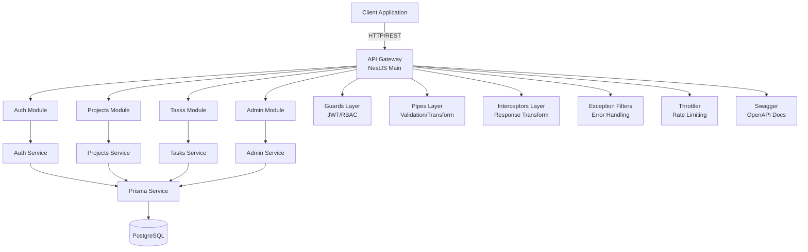
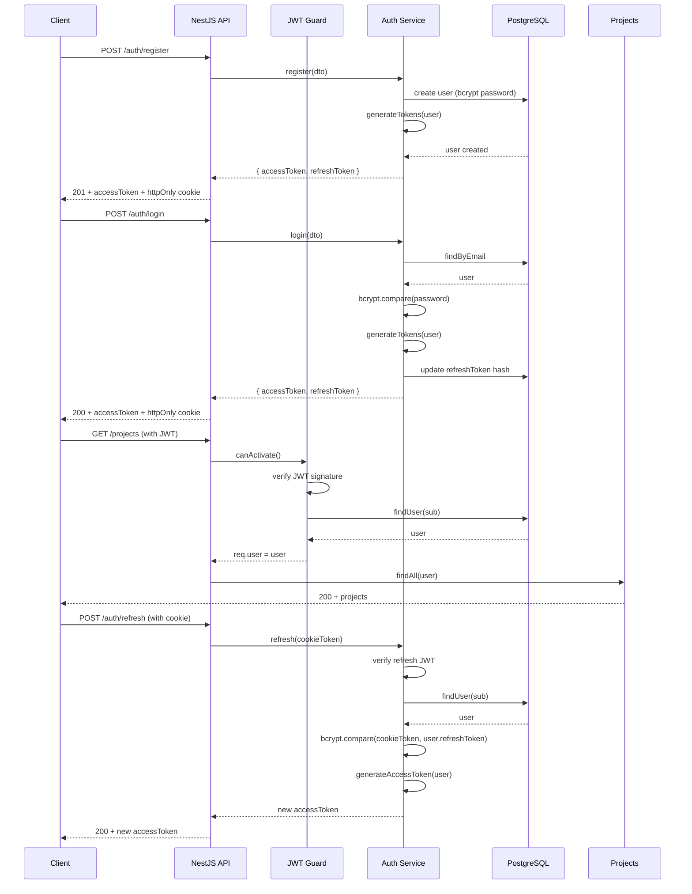
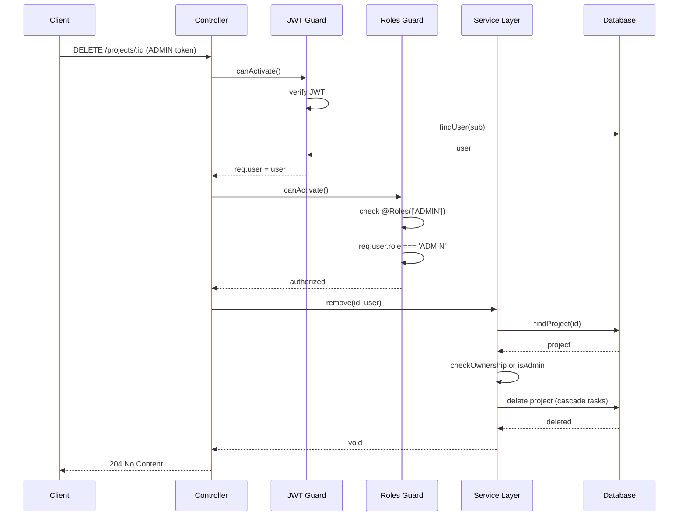

# Design Document: Nexus API

## Overview

Nexus is a production-grade project and task management REST API built with NestJS, designed for internship project tracking with role-based access control. The system supports two user roles (USER and ADMIN) with distinct permissions, implements JWT-based authentication with refresh tokens, and provides comprehensive CRUD operations for projects and tasks. The architecture follows NestJS best practices with dependency injection, guards, pipes, and interceptors for a maintainable, testable, and scalable enterprise application. The API uses Prisma ORM for type-safe database operations with PostgreSQL, includes rate limiting, comprehensive validation, and auto-generated OpenAPI documentation via Swagger.

## Architecture



## Main Authentication Flow



## RBAC Authorization Flow



## Components and Interfaces

### Component 1: Auth Module

**Purpose**: Handles user authentication, registration, token generation, and session management

**Interface**:
```typescript
interface IAuthService {
  register(dto: RegisterDto): Promise<AuthResponse>
  login(dto: LoginDto): Promise<AuthResponse>
  refresh(refreshToken: string): Promise<{ accessToken: string }>
  logout(userId: string): Promise<void>
  validateUser(email: string, password: string): Promise<User | null>
  generateTokens(user: User): Promise<{ accessToken: string; refreshToken: string }>
  hashRefreshToken(token: string): Promise<string>
}

interface AuthResponse {
  accessToken: string
  refreshToken: string
  user: Omit<User, 'password' | 'refreshToken'>
}
```

**Responsibilities**:
- User registration with password hashing (bcrypt, 12 rounds)
- User login with credential validation
- JWT access token generation (15min expiry, payload: { sub, email, role })
- JWT refresh token generation (7d expiry, stored as bcrypt hash in DB)
- Refresh token rotation and validation
- Logout with token invalidation
- Password security enforcement


### Component 2: Projects Module

**Purpose**: Manages project CRUD operations with ownership-based access control

**Interface**:
```typescript
interface IProjectsService {
  create(dto: CreateProjectDto, userId: string): Promise<Project>
  findAll(user: User, query: ProjectQueryDto): Promise<PaginatedResponse<Project>>
  findOne(id: string, user: User): Promise<Project>
  update(id: string, dto: UpdateProjectDto, user: User): Promise<Project>
  remove(id: string, user: User): Promise<void>
  findProjectTasks(projectId: string, user: User, query: TaskQueryDto): Promise<PaginatedResponse<Task>>
}

interface ProjectQueryDto {
  status?: ProjectStatus
  search?: string
  page?: number
  limit?: number
}
```

**Responsibilities**:
- Create projects owned by authenticated user
- List projects with pagination and filtering (USER sees own, ADMIN sees all)
- Retrieve single project with ownership validation
- Update project details (owner or ADMIN only)
- Delete project with cascade to tasks (owner or ADMIN only)
- Prevent updates to ARCHIVED projects
- Search projects by name (case-insensitive partial match)


### Component 3: Tasks Module

**Purpose**: Manages task CRUD operations scoped to projects with assignee tracking

**Interface**:
```typescript
interface ITasksService {
  create(projectId: string, dto: CreateTaskDto, user: User): Promise<Task>
  findOne(projectId: string, taskId: string, user: User): Promise<Task>
  update(projectId: string, taskId: string, dto: UpdateTaskDto, user: User): Promise<Task>
  remove(projectId: string, taskId: string, user: User): Promise<void>
  validateProjectAccess(projectId: string, user: User): Promise<Project>
}

interface CreateTaskDto {
  title: string
  description?: string
  status?: TaskStatus
  priority?: TaskPriority
  dueDate?: Date
  assigneeId?: string
}
```

**Responsibilities**:
- Create tasks within a project (project owner or ADMIN)
- Validate project exists and user has access
- Retrieve task with project scoping validation
- Update task details including status transitions
- Delete tasks (project owner or ADMIN)
- Validate assigneeId references valid user
- Reject task operations on ARCHIVED projects (403)
- Auto-update timestamps on status changes


### Component 4: Admin Module

**Purpose**: Provides administrative operations for user management and system statistics

**Interface**:
```typescript
interface IAdminService {
  getAllUsers(query: PaginationDto): Promise<PaginatedResponse<User>>
  getStats(): Promise<AdminStats>
  updateUserRole(userId: string, role: Role): Promise<User>
  getAllProjects(query: PaginationDto): Promise<PaginatedResponse<ProjectWithOwner>>
}

interface AdminStats {
  totalUsers: number
  totalProjects: number
  totalTasks: number
  tasksByStatus: Record<TaskStatus, number>
  tasksByPriority: Record<TaskPriority, number>
}
```

**Responsibilities**:
- List all users with pagination (passwords excluded)
- Generate system statistics (users, projects, tasks, groupings)
- Update user roles with validation (cannot demote last admin)
- List all projects with owner information
- Execute stats queries in transaction for consistency
- Enforce ADMIN-only access via RolesGuard


### Component 5: Guards Layer

**Purpose**: Implements authentication and authorization middleware

**Interface**:
```typescript
@Injectable()
class JwtAuthGuard extends AuthGuard('jwt') {
  canActivate(context: ExecutionContext): boolean | Promise<boolean>
  handleRequest(err: any, user: any, info: any): User
}

@Injectable()
class RolesGuard implements CanActivate {
  canActivate(context: ExecutionContext): boolean
}
```

**Responsibilities**:
- JWT signature verification and token validation
- User extraction from JWT payload and database lookup
- Role-based access control enforcement
- Request context enrichment with user object
- Unauthorized/Forbidden exception handling


### Component 6: Validation & Transform Layer

**Purpose**: Provides request validation, transformation, and response formatting

**Interface**:
```typescript
@Injectable()
class ValidationPipe implements PipeTransform {
  transform(value: any, metadata: ArgumentMetadata): any
}

@Injectable()
class TransformInterceptor implements NestInterceptor {
  intercept(context: ExecutionContext, next: CallHandler): Observable<ApiResponse<any>>
}

interface ApiResponse<T> {
  success: boolean
  data?: T
  meta?: PaginationMeta
  statusCode?: number
  message?: string
  errors?: string[]
  timestamp?: string
}
```

**Responsibilities**:
- DTO validation using class-validator decorators
- Whitelist unknown properties (forbidNonWhitelisted: true)
- Transform plain objects to class instances
- Format success responses with envelope structure
- Format error responses with consistent structure
- Return 422 for validation errors with field-level details


## Data Models

### Model 1: User

```typescript
interface User {
  id: string // UUID
  email: string // unique, validated
  password: string // bcrypt hash, never returned in responses
  name: string
  role: Role // enum: USER | ADMIN
  refreshToken: string | null // bcrypt hash of refresh JWT
  projects: Project[] // relation
  assignedTasks: Task[] // relation
  createdAt: Date
  updatedAt: Date
}

enum Role {
  USER = 'USER',
  ADMIN = 'ADMIN'
}
```

**Validation Rules**:
- email: valid email format, unique in database
- password: minimum 8 characters, must contain uppercase, lowercase, number, special char
- name: non-empty string, 2-100 characters
- role: must be valid Role enum value
- refreshToken: nullable, stored as bcrypt hash
- Passwords excluded from all Prisma select queries


### Model 2: Project

```typescript
interface Project {
  id: string // UUID
  name: string
  description: string | null
  status: ProjectStatus // enum: ACTIVE | ARCHIVED
  ownerId: string // foreign key to User
  owner: User // relation
  tasks: Task[] // relation, cascade delete
  createdAt: Date
  updatedAt: Date
}

enum ProjectStatus {
  ACTIVE = 'ACTIVE',
  ARCHIVED = 'ARCHIVED'
}
```

**Validation Rules**:
- name: non-empty string, 3-200 characters, required
- description: optional string, max 1000 characters
- status: must be valid ProjectStatus enum, defaults to ACTIVE
- ownerId: must reference existing User.id
- ARCHIVED projects are read-only for task operations
- Deleting project cascades to all tasks (Prisma onDelete: Cascade)


### Model 3: Task

```typescript
interface Task {
  id: string // UUID
  title: string
  description: string | null
  status: TaskStatus // enum: TODO | IN_PROGRESS | IN_REVIEW | DONE
  priority: TaskPriority // enum: LOW | MEDIUM | HIGH | URGENT
  dueDate: Date | null
  projectId: string // foreign key to Project
  project: Project // relation
  assigneeId: string | null // foreign key to User
  assignee: User | null // relation
  createdAt: Date
  updatedAt: Date // auto-updated on changes
}

enum TaskStatus {
  TODO = 'TODO',
  IN_PROGRESS = 'IN_PROGRESS',
  IN_REVIEW = 'IN_REVIEW',
  DONE = 'DONE'
}

enum TaskPriority {
  LOW = 'LOW',
  MEDIUM = 'MEDIUM',
  HIGH = 'HIGH',
  URGENT = 'URGENT'
}
```

**Validation Rules**:
- title: non-empty string, 3-200 characters, required
- description: optional string, max 2000 characters
- status: must be valid TaskStatus enum, defaults to TODO
- priority: must be valid TaskPriority enum, defaults to MEDIUM
- dueDate: optional ISO8601 date, must be future date
- projectId: must reference existing Project.id
- assigneeId: optional, must reference existing User.id if provided
- Cannot create/update tasks in ARCHIVED projects


## Algorithmic Pseudocode

### Main Authentication Algorithm

```typescript
async function authenticate(credentials: LoginDto): Promise<AuthResponse> {
  // INPUT: credentials with email and password
  // OUTPUT: AuthResponse with tokens and user data
  // PRECONDITION: credentials.email is valid email format
  // PRECONDITION: credentials.password is non-empty string
  // POSTCONDITION: Returns valid tokens if authentication succeeds
  // POSTCONDITION: Throws UnauthorizedException if authentication fails
  // POSTCONDITION: refreshToken hash stored in database
  
  const user = await prisma.user.findUnique({
    where: { email: credentials.email },
    select: { id: true, email: true, password: true, name: true, role: true }
  })
  
  if (!user) {
    throw new UnauthorizedException('Invalid credentials')
  }
  
  const isPasswordValid = await bcrypt.compare(credentials.password, user.password)
  
  if (!isPasswordValid) {
    throw new UnauthorizedException('Invalid credentials')
  }
  
  const { accessToken, refreshToken } = await generateTokens(user)
  
  const refreshTokenHash = await bcrypt.hash(refreshToken, 12)
  
  await prisma.user.update({
    where: { id: user.id },
    data: { refreshToken: refreshTokenHash }
  })
  
  const { password, ...userWithoutPassword } = user
  
  return {
    accessToken,
    refreshToken,
    user: userWithoutPassword
  }
}
```

**Preconditions**:
- credentials.email is valid email format (validated by DTO)
- credentials.password is non-empty string
- Database connection is available

**Postconditions**:
- Returns AuthResponse with valid JWT tokens if authentication succeeds
- Throws UnauthorizedException with message if user not found or password invalid
- refreshToken hash is stored in user.refreshToken column
- Password is never included in response
- accessToken expires in 15 minutes
- refreshToken expires in 7 days

**Loop Invariants**: N/A (no loops in this algorithm)


### Token Refresh Algorithm

```typescript
async function refreshAccessToken(refreshToken: string): Promise<{ accessToken: string }> {
  // INPUT: refreshToken from httpOnly cookie
  // OUTPUT: new accessToken
  // PRECONDITION: refreshToken is valid JWT string
  // POSTCONDITION: Returns new accessToken if refresh succeeds
  // POSTCONDITION: Throws UnauthorizedException if token invalid or user not found
  
  let payload: JwtPayload
  
  try {
    payload = jwt.verify(refreshToken, JWT_REFRESH_SECRET) as JwtPayload
  } catch (error) {
    throw new UnauthorizedException('Invalid refresh token')
  }
  
  const user = await prisma.user.findUnique({
    where: { id: payload.sub },
    select: { id: true, email: true, role: true, refreshToken: true }
  })
  
  if (!user || !user.refreshToken) {
    throw new UnauthorizedException('Invalid refresh token')
  }
  
  const isTokenValid = await bcrypt.compare(refreshToken, user.refreshToken)
  
  if (!isTokenValid) {
    throw new UnauthorizedException('Invalid refresh token')
  }
  
  const accessToken = jwt.sign(
    { sub: user.id, email: user.email, role: user.role },
    JWT_ACCESS_SECRET,
    { expiresIn: '15m' }
  )
  
  return { accessToken }
}
```

**Preconditions**:
- refreshToken is non-empty string
- JWT_REFRESH_SECRET is configured
- Database connection is available

**Postconditions**:
- Returns new accessToken if refresh token is valid and matches stored hash
- Throws UnauthorizedException if token signature invalid
- Throws UnauthorizedException if user not found or refreshToken null in DB
- Throws UnauthorizedException if token doesn't match stored hash
- New accessToken expires in 15 minutes

**Loop Invariants**: N/A (no loops in this algorithm)


### Project Access Control Algorithm

```typescript
async function findAllProjects(user: User, query: ProjectQueryDto): Promise<PaginatedResponse<Project>> {
  // INPUT: authenticated user and query parameters
  // OUTPUT: paginated list of projects
  // PRECONDITION: user is authenticated (non-null)
  // PRECONDITION: query.page >= 1, query.limit >= 1
  // POSTCONDITION: USER role returns only owned projects
  // POSTCONDITION: ADMIN role returns all projects
  // POSTCONDITION: Results filtered by status and search if provided
  
  const page = query.page || 1
  const limit = query.limit || 20
  const skip = (page - 1) * limit
  
  const where: Prisma.ProjectWhereInput = {}
  
  // Role-based filtering
  if (user.role === Role.USER) {
    where.ownerId = user.id
  }
  // ADMIN sees all projects (no ownerId filter)
  
  // Status filtering
  if (query.status) {
    where.status = query.status
  }
  
  // Search filtering (case-insensitive partial match on name)
  if (query.search) {
    where.name = {
      contains: query.search,
      mode: 'insensitive'
    }
  }
  
  const [projects, total] = await prisma.$transaction([
    prisma.project.findMany({
      where,
      skip,
      take: limit,
      include: { owner: { select: { id: true, name: true, email: true } } },
      orderBy: { createdAt: 'desc' }
    }),
    prisma.project.count({ where })
  ])
  
  return {
    success: true,
    data: projects,
    meta: {
      page,
      limit,
      total,
      totalPages: Math.ceil(total / limit)
    }
  }
}
```

**Preconditions**:
- user is authenticated and non-null
- query.page is positive integer or undefined (defaults to 1)
- query.limit is positive integer or undefined (defaults to 20)
- Database connection is available

**Postconditions**:
- USER role returns only projects where ownerId === user.id
- ADMIN role returns all projects regardless of ownership
- Results filtered by status if query.status provided
- Results filtered by name search if query.search provided (case-insensitive)
- Returns paginated response with correct skip/take calculations
- Total count reflects filtered results
- Projects ordered by createdAt descending

**Loop Invariants**: N/A (database operations, no explicit loops)


### Task Creation with Project Validation Algorithm

```typescript
async function createTask(projectId: string, dto: CreateTaskDto, user: User): Promise<Task> {
  // INPUT: projectId, task data, authenticated user
  // OUTPUT: created task
  // PRECONDITION: projectId is valid UUID
  // PRECONDITION: user is authenticated
  // PRECONDITION: dto is validated (title non-empty, valid enums)
  // POSTCONDITION: Task created only if user has access to project
  // POSTCONDITION: Throws ForbiddenException if project is ARCHIVED
  // POSTCONDITION: Throws NotFoundException if project not found
  
  const project = await prisma.project.findUnique({
    where: { id: projectId },
    select: { id: true, ownerId: true, status: true }
  })
  
  if (!project) {
    throw new NotFoundException('Project not found')
  }
  
  // Access control: USER must own project, ADMIN bypasses
  if (user.role === Role.USER && project.ownerId !== user.id) {
    throw new ForbiddenException('Access denied to this project')
  }
  
  // Prevent task creation in archived projects
  if (project.status === ProjectStatus.ARCHIVED) {
    throw new ForbiddenException('Cannot create tasks in archived projects')
  }
  
  // Validate assigneeId if provided
  if (dto.assigneeId) {
    const assignee = await prisma.user.findUnique({
      where: { id: dto.assigneeId },
      select: { id: true }
    })
    
    if (!assignee) {
      throw new NotFoundException('Assignee user not found')
    }
  }
  
  const task = await prisma.task.create({
    data: {
      title: dto.title,
      description: dto.description,
      status: dto.status || TaskStatus.TODO,
      priority: dto.priority || TaskPriority.MEDIUM,
      dueDate: dto.dueDate,
      projectId: projectId,
      assigneeId: dto.assigneeId
    },
    include: {
      project: { select: { id: true, name: true } },
      assignee: { select: { id: true, name: true, email: true } }
    }
  })
  
  return task
}
```

**Preconditions**:
- projectId is valid UUID format (validated by ParseUUIDPipe)
- user is authenticated and non-null
- dto.title is non-empty string (validated by class-validator)
- dto.status is valid TaskStatus enum if provided
- dto.priority is valid TaskPriority enum if provided
- dto.dueDate is valid Date if provided

**Postconditions**:
- Task created and returned if all validations pass
- Throws NotFoundException if project doesn't exist
- Throws ForbiddenException if USER role and not project owner
- Throws ForbiddenException if project status is ARCHIVED
- Throws NotFoundException if assigneeId provided but user doesn't exist
- Task defaults: status=TODO, priority=MEDIUM if not provided
- Task includes related project and assignee data in response

**Loop Invariants**: N/A (no loops in this algorithm)


### Admin Statistics Generation Algorithm

```typescript
async function getAdminStats(): Promise<AdminStats> {
  // INPUT: none (ADMIN-only endpoint)
  // OUTPUT: system statistics
  // PRECONDITION: caller has ADMIN role (enforced by RolesGuard)
  // POSTCONDITION: Returns accurate counts and groupings
  // POSTCONDITION: All queries executed in transaction for consistency
  
  const [
    totalUsers,
    totalProjects,
    totalTasks,
    tasksByStatus,
    tasksByPriority
  ] = await prisma.$transaction([
    prisma.user.count(),
    prisma.project.count(),
    prisma.task.count(),
    prisma.task.groupBy({
      by: ['status'],
      _count: { status: true }
    }),
    prisma.task.groupBy({
      by: ['priority'],
      _count: { priority: true }
    })
  ])
  
  // Transform groupBy results to Record<enum, number>
  const statusCounts: Record<TaskStatus, number> = {
    TODO: 0,
    IN_PROGRESS: 0,
    IN_REVIEW: 0,
    DONE: 0
  }
  
  for (const group of tasksByStatus) {
    statusCounts[group.status] = group._count.status
  }
  
  const priorityCounts: Record<TaskPriority, number> = {
    LOW: 0,
    MEDIUM: 0,
    HIGH: 0,
    URGENT: 0
  }
  
  for (const group of tasksByPriority) {
    priorityCounts[group.priority] = group._count.priority
  }
  
  return {
    totalUsers,
    totalProjects,
    totalTasks,
    tasksByStatus: statusCounts,
    tasksByPriority: priorityCounts
  }
}
```

**Preconditions**:
- Caller has ADMIN role (enforced by @Roles(['ADMIN']) decorator and RolesGuard)
- Database connection is available
- Prisma client is initialized

**Postconditions**:
- Returns AdminStats with accurate counts at transaction snapshot time
- All queries executed in single transaction for consistency
- tasksByStatus includes all TaskStatus enum values (0 if none exist)
- tasksByPriority includes all TaskPriority enum values (0 if none exist)
- No passwords or sensitive data included in response

**Loop Invariants**:
- For tasksByStatus transformation loop: All processed status values are valid TaskStatus enums
- For tasksByPriority transformation loop: All processed priority values are valid TaskPriority enums


## Key Functions with Formal Specifications

### Function 1: generateTokens()

```typescript
async function generateTokens(user: User): Promise<{ accessToken: string; refreshToken: string }>
```

**Preconditions**:
- user is non-null and has valid id, email, role fields
- JWT_ACCESS_SECRET is configured in environment
- JWT_REFRESH_SECRET is configured in environment

**Postconditions**:
- Returns object with both accessToken and refreshToken
- accessToken is valid JWT signed with JWT_ACCESS_SECRET
- accessToken payload contains { sub: user.id, email: user.email, role: user.role }
- accessToken expires in 15 minutes
- refreshToken is valid JWT signed with JWT_REFRESH_SECRET
- refreshToken payload contains { sub: user.id }
- refreshToken expires in 7 days
- Both tokens are cryptographically signed and verifiable

**Loop Invariants**: N/A (no loops)

### Function 2: validateProjectOwnership()

```typescript
async function validateProjectOwnership(projectId: string, user: User): Promise<Project>
```

**Preconditions**:
- projectId is valid UUID format
- user is authenticated and non-null

**Postconditions**:
- Returns Project if user is owner OR user has ADMIN role
- Throws NotFoundException if project doesn't exist
- Throws ForbiddenException if USER role and not owner
- ADMIN role bypasses ownership check
- Returned project includes all fields

**Loop Invariants**: N/A (no loops)

### Function 3: hashPassword()

```typescript
async function hashPassword(plainPassword: string): Promise<string>
```

**Preconditions**:
- plainPassword is non-empty string
- bcrypt library is available

**Postconditions**:
- Returns bcrypt hash string
- Hash uses 12 salt rounds
- Hash is one-way (cannot be reversed to plainPassword)
- Same plainPassword produces different hashes (due to salt)
- Hash can be verified with bcrypt.compare()

**Loop Invariants**: N/A (no loops)


### Function 4: paginateResults()

```typescript
function paginateResults<T>(data: T[], total: number, page: number, limit: number): PaginatedResponse<T>
```

**Preconditions**:
- data is array of items (may be empty)
- total is non-negative integer representing total count
- page is positive integer >= 1
- limit is positive integer >= 1

**Postconditions**:
- Returns PaginatedResponse with success=true
- data field contains provided array
- meta.page equals input page
- meta.limit equals input limit
- meta.total equals input total
- meta.totalPages = Math.ceil(total / limit)
- If total=0, totalPages=0
- If total > 0, totalPages >= 1

**Loop Invariants**: N/A (no loops)

### Function 5: excludePassword()

```typescript
function excludePassword<T extends { password?: string }>(user: T): Omit<T, 'password'>
```

**Preconditions**:
- user is object (may or may not have password field)

**Postconditions**:
- Returns new object without password field
- All other fields preserved
- Original object unchanged (immutable operation)
- If password field didn't exist, returns equivalent object
- Type safety enforced at compile time

**Loop Invariants**: N/A (no loops)


## Example Usage

### Example 1: User Registration and Login Flow

```typescript
// Register new user
const registerDto = {
  email: 'alice@nexus.dev',
  password: 'SecurePass123!',
  name: 'Alice Johnson'
}

const registerResponse = await fetch('http://localhost:3000/api/v1/auth/register', {
  method: 'POST',
  headers: { 'Content-Type': 'application/json' },
  body: JSON.stringify(registerDto),
  credentials: 'include' // Important for cookies
})

const { success, data } = await registerResponse.json()
// data: { accessToken: "eyJhbGc...", user: { id, email, name, role } }
// Cookie: refreshToken (httpOnly, secure, sameSite)

// Use access token for authenticated requests
const projectsResponse = await fetch('http://localhost:3000/api/v1/projects', {
  headers: { 
    'Authorization': `Bearer ${data.accessToken}`,
    'Content-Type': 'application/json'
  },
  credentials: 'include'
})

const projects = await projectsResponse.json()
// { success: true, data: [...], meta: { page, limit, total, totalPages } }
```

### Example 2: Project and Task Management

```typescript
// Create project
const createProjectDto = {
  name: 'Mobile App Redesign',
  description: 'Complete UI/UX overhaul for mobile application',
  status: 'ACTIVE'
}

const projectResponse = await fetch('http://localhost:3000/api/v1/projects', {
  method: 'POST',
  headers: { 
    'Authorization': `Bearer ${accessToken}`,
    'Content-Type': 'application/json'
  },
  body: JSON.stringify(createProjectDto)
})

const { data: project } = await projectResponse.json()
// project: { id: "uuid", name: "Mobile App Redesign", ... }

// Create task in project
const createTaskDto = {
  title: 'Design login screen mockups',
  description: 'Create high-fidelity mockups for new login flow',
  status: 'TODO',
  priority: 'HIGH',
  dueDate: '2024-12-31T23:59:59Z',
  assigneeId: 'user-uuid'
}

const taskResponse = await fetch(`http://localhost:3000/api/v1/projects/${project.id}/tasks`, {
  method: 'POST',
  headers: { 
    'Authorization': `Bearer ${accessToken}`,
    'Content-Type': 'application/json'
  },
  body: JSON.stringify(createTaskDto)
})

const { data: task } = await taskResponse.json()
// task: { id, title, status, priority, project: {...}, assignee: {...} }
```


### Example 3: Token Refresh Flow

```typescript
// Access token expired, refresh it
const refreshResponse = await fetch('http://localhost:3000/api/v1/auth/refresh', {
  method: 'POST',
  credentials: 'include' // Sends httpOnly cookie automatically
})

if (refreshResponse.ok) {
  const { data } = await refreshResponse.json()
  // data: { accessToken: "new-jwt-token" }
  
  // Update stored access token
  localStorage.setItem('accessToken', data.accessToken)
  
  // Retry original request with new token
  const retryResponse = await fetch(originalUrl, {
    headers: { 'Authorization': `Bearer ${data.accessToken}` }
  })
} else {
  // Refresh failed, redirect to login
  window.location.href = '/login'
}
```

### Example 4: Admin Operations

```typescript
// Get system statistics (ADMIN only)
const statsResponse = await fetch('http://localhost:3000/api/v1/admin/stats', {
  headers: { 'Authorization': `Bearer ${adminAccessToken}` }
})

const { data: stats } = await statsResponse.json()
// stats: {
//   totalUsers: 150,
//   totalProjects: 45,
//   totalTasks: 320,
//   tasksByStatus: { TODO: 120, IN_PROGRESS: 80, IN_REVIEW: 60, DONE: 60 },
//   tasksByPriority: { LOW: 50, MEDIUM: 150, HIGH: 80, URGENT: 40 }
// }

// Update user role (ADMIN only)
const updateRoleResponse = await fetch('http://localhost:3000/api/v1/admin/users/user-uuid/role', {
  method: 'PATCH',
  headers: { 
    'Authorization': `Bearer ${adminAccessToken}`,
    'Content-Type': 'application/json'
  },
  body: JSON.stringify({ role: 'ADMIN' })
})

const { data: updatedUser } = await updateRoleResponse.json()
// updatedUser: { id, email, name, role: 'ADMIN', ... }
```

### Example 5: Error Handling

```typescript
// Attempt to access project without permission
const forbiddenResponse = await fetch('http://localhost:3000/api/v1/projects/other-user-project-id', {
  headers: { 'Authorization': `Bearer ${userAccessToken}` }
})

if (!forbiddenResponse.ok) {
  const error = await forbiddenResponse.json()
  // error: {
  //   success: false,
  //   statusCode: 403,
  //   message: 'Access denied to this project',
  //   timestamp: '2024-01-15T10:30:00.000Z'
  // }
}

// Validation error example
const invalidTaskResponse = await fetch('http://localhost:3000/api/v1/projects/project-id/tasks', {
  method: 'POST',
  headers: { 
    'Authorization': `Bearer ${accessToken}`,
    'Content-Type': 'application/json'
  },
  body: JSON.stringify({ title: '' }) // Invalid: empty title
})

const validationError = await invalidTaskResponse.json()
// validationError: {
//   success: false,
//   statusCode: 422,
//   message: 'Validation failed',
//   errors: ['title should not be empty', 'title must be longer than 3 characters'],
//   timestamp: '2024-01-15T10:30:00.000Z'
// }
```


## Correctness Properties

*A property is a characteristic or behavior that should hold true across all valid executions of a system—essentially, a formal statement about what the system should do. Properties serve as the bridge between human-readable specifications and machine-verifiable correctness guarantees.*

### Property 1: Password Hashing Security

*For any* user registration or password update, the password stored in the database must be a bcrypt hash with 12 salt rounds, and bcrypt.compare(plainPassword, storedHash) must return true.

**Validates: Requirements 1.6, 2.1**

### Property 2: Password Exclusion from Responses

*For any* API response containing user data, the password and refreshToken fields must not be present in the response payload.

**Validates: Requirements 2.6, 17.3, 27.7**

### Property 3: Access Token Expiry

*For any* generated access token, the token must be a valid JWT signed with JWT_ACCESS_SECRET and have an expiry time of exactly 15 minutes from issuance.

**Validates: Requirements 3.5**

### Property 4: Refresh Token Expiry and Storage

*For any* generated refresh token, the token must be a valid JWT signed with JWT_REFRESH_SECRET, have an expiry time of exactly 7 days from issuance, and be stored in the database as a bcrypt hash.

**Validates: Requirements 2.3, 3.6**

### Property 5: JWT Authentication Populates User

*For any* request to a protected endpoint with a valid JWT access token, the system must extract the user from the token payload and populate request.user with the authenticated user object.

**Validates: Requirements 5.1, 5.2**

### Property 6: USER Role Ownership Access Control

*For any* USER role and any project, if the project.ownerId does not match the user.id, then access to that project must be denied with a 403 Forbidden error.

**Validates: Requirements 8.1, 9.2, 10.3, 11.4**

### Property 7: ADMIN Role Bypass

*For any* user with role=ADMIN and any resource, access must be granted regardless of ownership.

**Validates: Requirements 8.2, 9.3, 10.2, 11.2, 13.2, 14.2, 15.2, 16.2**

### Property 8: Admin Endpoint Protection

*For any* request to an admin-only endpoint where the caller's role is not ADMIN, the system must return a 403 Forbidden error.

**Validates: Requirements 6.2, 17.2, 18.6, 19.3, 20.2**

### Property 9: Archived Project Task Rejection

*For any* project with status=ARCHIVED, any attempt to create or update tasks in that project must be rejected with a 403 Forbidden error.

**Validates: Requirements 12.4, 14.4**

### Property 10: Task Project Reference Integrity

*For any* task creation or update, the projectId must reference an existing project, otherwise the operation must fail with a 404 Not Found error.

**Validates: Requirements 12.10, 28.2**

### Property 11: Task Assignee Reference Integrity

*For any* task with a non-null assigneeId, the assigneeId must reference an existing user, otherwise the operation must fail with a 404 Not Found error.

**Validates: Requirements 12.7, 14.6, 28.3**

### Property 12: Project Deletion Cascade

*For any* project deletion, all tasks where task.projectId equals the deleted project's ID must be cascade deleted from the database.

**Validates: Requirements 11.3, 28.1**

### Property 13: Pagination Calculation Correctness

*For any* paginated query with page and limit parameters, the skip value must equal (page - 1) × limit, and totalPages must equal ceiling(total / limit).

**Validates: Requirements 22.5, 29.1, 29.2**

### Property 14: Pagination Metadata Completeness

*For any* paginated response, the meta field must exist and contain page, limit, total, and totalPages fields.

**Validates: Requirements 8.5, 16.4, 17.4, 20.3, 22.3**

### Property 15: Validation Error Response Format

*For any* request with invalid data that fails validation, the system must return a 422 Unprocessable Entity status with field-level error messages.

**Validates: Requirements 21.1, 21.2**

### Property 16: Unknown Property Rejection

*For any* request containing properties not defined in the DTO, the system must reject the request with a 400 Bad Request error.

**Validates: Requirement 21.3**

### Property 17: UUID Parameter Validation

*For any* URL parameter that should be a UUID, if the format is invalid, the system must return a 400 Bad Request error.

**Validates: Requirement 21.4**

### Property 18: Success Response Envelope

*For any* successful API request, the response must have success=true and a data field containing the response payload.

**Validates: Requirement 22.1**

### Property 19: Error Response Envelope

*For any* failed API request, the response must have success=false, a statusCode field, and a message field.

**Validates: Requirements 22.2, 22.4**

### Property 20: Global Rate Limiting

*For any* client IP address, if the number of requests exceeds 100 per minute, the system must return a 429 Too Many Requests error with a Retry-After header.

**Validates: Requirements 23.1, 23.3**

### Property 21: Auth Endpoint Rate Limiting

*For any* client IP address making requests to auth endpoints, if the number of requests exceeds 10 per minute, the system must return a 429 Too Many Requests error.

**Validates: Requirement 23.2**

### Property 22: Security Headers Present

*For any* API response, the following security headers must be present: X-Frame-Options=DENY, X-Content-Type-Options=nosniff, and Content-Security-Policy.

**Validates: Requirements 24.1, 24.2, 24.4**

### Property 23: CORS Origin Restriction

*For any* cross-origin request, the system must only allow requests from the configured CLIENT_URL origin and set Access-Control-Allow-Credentials=true.

**Validates: Requirements 25.1, 25.2**

### Property 24: Refresh Token Cookie Security

*For any* response that sets a refresh token cookie, the cookie must have httpOnly=true, sameSite='strict', and expiry matching the refresh token expiry (7 days).

**Validates: Requirements 26.1, 26.3, 26.4**

### Property 25: Password Validation Requirements

*For any* password submission, the system must validate that it is at least 8 characters long and contains at least one uppercase letter, one lowercase letter, one number, and one special character.

**Validates: Requirements 27.1, 27.2, 27.3, 27.4, 27.5**

### Property 26: Project Ownership Assignment

*For any* project creation, the ownerId must be set to the authenticated user's ID.

**Validates: Requirement 7.1**

### Property 27: Project Default Status

*For any* project created without an explicit status, the status must default to ACTIVE.

**Validates: Requirement 7.2**

### Property 28: Task Default Values

*For any* task created without explicit status or priority, the status must default to TODO and priority must default to MEDIUM.

**Validates: Requirements 12.8, 12.9**

### Property 29: Token Refresh Validation

*For any* refresh token submission, the system must verify the JWT signature and compare the token against the stored bcrypt hash, rejecting the request if either check fails.

**Validates: Requirements 3.1, 3.2**

### Property 30: Logout Token Invalidation

*For any* user logout, the user's refreshToken field in the database must be set to null and the refresh token cookie must be cleared.

**Validates: Requirements 4.1, 4.2**

### Property 31: Default Role Assignment

*For any* user registration without an explicit role, the role must be set to USER.

**Validates: Requirement 1.4**

### Property 32: Admin Statistics Accuracy

*For any* admin statistics request, the sum of tasksByStatus counts must equal totalTasks, and the sum of tasksByPriority counts must equal totalTasks.

**Validates: Requirements 18.1, 18.2, 18.3, 18.4, 18.5**

### Property 33: Role Update Validation

*For any* role update request, the role value must be either USER or ADMIN, otherwise the request must be rejected.

**Validates: Requirement 19.4**

### Property 34: Task Update Timestamp

*For any* task update, the updatedAt timestamp must be modified to reflect the current time.

**Validates: Requirement 14.7**

### Property 35: Project Name Validation

*For any* project creation or update, the name must be between 3 and 200 characters, otherwise the request must be rejected with a 422 error.

**Validates: Requirements 7.3, 10.4**

### Property 36: Task Title Validation

*For any* task creation or update, the title must be between 3 and 200 characters, otherwise the request must be rejected with a 422 error.

**Validates: Requirements 12.5, 14.5**

### Property 37: Email Format Validation

*For any* user registration, the email must be in valid email format, otherwise the request must be rejected with a 422 error.

**Validates: Requirement 1.7**

### Property 38: Search Filter Case Insensitivity

*For any* project search query, all returned projects must have names that contain the search term in a case-insensitive manner.

**Validates: Requirement 8.4**

### Property 39: Status Filter Correctness

*For any* project list request with a status filter, all returned projects must have the specified status.

**Validates: Requirement 8.3**

### Property 40: Response Data Inclusion

*For any* successful project or task retrieval, the response must include related entity information (owner for projects, project and assignee for tasks).

**Validates: Requirements 7.5, 9.5, 13.5, 16.5, 20.4**


## Error Handling

### Error Scenario 1: Invalid Credentials

**Condition**: User provides incorrect email or password during login
**Response**: 401 Unauthorized with message "Invalid credentials"
**Recovery**: User must retry with correct credentials; no account lockout implemented

### Error Scenario 2: Expired Access Token

**Condition**: Client sends request with expired JWT access token
**Response**: 401 Unauthorized with message "Token expired"
**Recovery**: Client should call POST /auth/refresh with httpOnly cookie to obtain new access token, then retry original request

### Error Scenario 3: Unauthorized Project Access

**Condition**: USER role attempts to access project owned by another user
**Response**: 403 Forbidden with message "Access denied to this project"
**Recovery**: User cannot access; must request project owner to share or grant permissions (future feature)

### Error Scenario 4: Archived Project Modification

**Condition**: User attempts to create or update task in project with status=ARCHIVED
**Response**: 403 Forbidden with message "Cannot create/update tasks in archived projects"
**Recovery**: Project owner must change project status to ACTIVE before task operations allowed

### Error Scenario 5: Validation Failure

**Condition**: Client sends request with invalid DTO (e.g., empty title, invalid email format)
**Response**: 422 Unprocessable Entity with field-level errors array
**Recovery**: Client must correct validation errors and resubmit request

### Error Scenario 6: Resource Not Found

**Condition**: Client requests project, task, or user that doesn't exist
**Response**: 404 Not Found with message "[Resource] not found"
**Recovery**: Client should verify resource ID and handle gracefully in UI

### Error Scenario 7: Rate Limit Exceeded

**Condition**: Client exceeds 100 requests/minute (or 10/min for auth endpoints)
**Response**: 429 Too Many Requests with Retry-After header
**Recovery**: Client must wait for rate limit window to reset before retrying

### Error Scenario 8: Duplicate Email Registration

**Condition**: User attempts to register with email that already exists
**Response**: 409 Conflict with message "Email already registered"
**Recovery**: User should login instead or use password reset flow (future feature)

### Error Scenario 9: Invalid Refresh Token

**Condition**: Refresh token signature invalid, expired, or doesn't match stored hash
**Response**: 401 Unauthorized with message "Invalid refresh token"
**Recovery**: User must login again to obtain new token pair; session effectively ended

### Error Scenario 10: Last Admin Demotion

**Condition**: Admin attempts to change role of last remaining ADMIN user to USER
**Response**: 403 Forbidden with message "Cannot demote last admin user"
**Recovery**: Must promote another user to ADMIN before demoting current admin


## Testing Strategy

### Unit Testing Approach

Unit tests focus on isolated service methods and utility functions using Jest with mocked dependencies.

**Key Test Cases**:

1. **Auth Service**
   - `register()`: creates user with hashed password, returns tokens
   - `login()`: validates credentials, throws on invalid password
   - `generateTokens()`: returns valid JWT pair with correct expiry
   - `hashRefreshToken()`: produces bcrypt hash
   - `refresh()`: validates token signature and stored hash match
   - `logout()`: nullifies refreshToken in database

2. **Projects Service**
   - `create()`: creates project with ownerId set to current user
   - `findAll()`: USER sees only owned projects, ADMIN sees all
   - `findAll()`: filters by status and search query correctly
   - `findOne()`: throws ForbiddenException for non-owner USER
   - `update()`: allows owner or ADMIN to update
   - `remove()`: cascades to tasks, throws for non-owner USER

3. **Tasks Service**
   - `create()`: validates project exists and user has access
   - `create()`: throws ForbiddenException for ARCHIVED projects
   - `create()`: validates assigneeId references valid user
   - `update()`: allows status transitions, updates timestamp
   - `remove()`: validates project access before deletion

4. **Admin Service**
   - `getStats()`: returns accurate counts from transaction
   - `updateUserRole()`: prevents last admin demotion
   - `getAllUsers()`: excludes passwords from results

5. **Guards**
   - `JwtAuthGuard`: extracts user from valid token, throws on invalid
   - `RolesGuard`: allows ADMIN, blocks USER for admin endpoints

6. **Utilities**
   - `paginateResults()`: calculates totalPages correctly
   - `excludePassword()`: removes password field immutably

**Coverage Goals**: Minimum 80% line coverage, 90% for critical auth and authorization paths


### Property-Based Testing Approach

Property-based tests use fast-check library to generate random inputs and verify invariants hold across all cases.

**Property Test Library**: fast-check (TypeScript/JavaScript)

**Key Properties to Test**:

1. **Password Hashing Idempotence**
   - Property: ∀ password: bcrypt.compare(password, hash(password)) = true
   - Generator: fc.string({ minLength: 8, maxLength: 100 })

2. **Pagination Calculation**
   - Property: ∀ total, limit > 0: totalPages = ⌈total / limit⌉
   - Property: ∀ page, limit > 0: skip = (page - 1) × limit
   - Generators: fc.nat(), fc.integer({ min: 1, max: 100 })

3. **JWT Token Roundtrip**
   - Property: ∀ payload: verify(sign(payload, secret), secret) = payload
   - Generator: fc.record({ sub: fc.uuid(), email: fc.emailAddress(), role: fc.constantFrom('USER', 'ADMIN') })

4. **Role-Based Access**
   - Property: ∀ user with role=ADMIN: hasAccess(user, anyResource) = true
   - Property: ∀ user with role=USER, resource: hasAccess(user, resource) = (resource.ownerId === user.id)
   - Generators: fc.record({ id: fc.uuid(), role: fc.constantFrom('USER', 'ADMIN') })

5. **Validation Consistency**
   - Property: ∀ dto: validate(dto) fails ⟹ statusCode = 422
   - Property: ∀ dto: validate(dto) succeeds ⟹ dto transformed to class instance
   - Generators: fc.record with various valid/invalid field combinations

6. **Response Envelope Structure**
   - Property: ∀ success response: response.success = true ∧ response.data exists
   - Property: ∀ error response: response.success = false ∧ response.statusCode ∈ [400, 599]
   - Generators: fc.anything() for data payloads

**Test Execution**: Run 100 random cases per property, shrink failing cases to minimal counterexample


### Integration Testing Approach

Integration tests use Jest + Supertest to test full HTTP request/response cycles against real database (test container).

**Test Files**:

1. **test/auth.e2e-spec.ts**
   - POST /auth/register: creates user, returns tokens, sets cookie
   - POST /auth/login: authenticates user, returns tokens, sets cookie
   - POST /auth/refresh: validates cookie, returns new access token
   - POST /auth/logout: clears refreshToken in DB, clears cookie
   - GET /auth/me: returns current user without password
   - Error cases: invalid credentials, expired tokens, missing cookies

2. **test/projects.e2e-spec.ts**
   - GET /projects: USER sees own, ADMIN sees all
   - GET /projects?status=ACTIVE&search=mobile: filters correctly
   - POST /projects: creates project for current user
   - GET /projects/:id: owner and ADMIN can access, others get 403
   - PATCH /projects/:id: owner and ADMIN can update
   - DELETE /projects/:id: cascades to tasks, owner and ADMIN only
   - GET /projects/:id/tasks: returns paginated tasks
   - Error cases: non-existent project, unauthorized access

3. **test/tasks.e2e-spec.ts**
   - POST /projects/:projectId/tasks: creates task with validation
   - POST to ARCHIVED project: returns 403
   - GET /projects/:projectId/tasks/:id: retrieves task with relations
   - PATCH /projects/:projectId/tasks/:id: updates status and priority
   - DELETE /projects/:projectId/tasks/:id: removes task
   - Invalid assigneeId: returns 404
   - Error cases: invalid projectId, task not in project

4. **test/admin.e2e-spec.ts**
   - GET /admin/users: ADMIN gets all users, USER gets 403
   - GET /admin/stats: returns accurate counts and groupings
   - PATCH /admin/users/:id/role: updates role, prevents last admin demotion
   - GET /admin/projects: returns all projects with owner info

**Test Setup**:
- Docker test container with PostgreSQL
- Prisma migrations applied before tests
- Database seeded with test users (USER and ADMIN)
- Cleanup after each test suite
- Supertest for HTTP assertions
- JWT tokens generated for authenticated requests

**Coverage Goals**: All critical user flows covered, minimum 70% endpoint coverage


## Performance Considerations

### Database Query Optimization

1. **Indexing Strategy**
   - Primary keys (id) automatically indexed as UUID
   - Foreign keys (ownerId, projectId, assigneeId) indexed for join performance
   - User.email indexed as unique for fast login lookups
   - Consider composite index on (projectId, status) for task filtering

2. **Query Efficiency**
   - Use Prisma select to fetch only required fields
   - Avoid N+1 queries with include for relations
   - Use transactions for multi-query operations (admin stats)
   - Implement cursor-based pagination for large datasets (future enhancement)

3. **Connection Pooling**
   - Prisma connection pool configured via DATABASE_URL
   - Default pool size: 10 connections
   - Adjust based on concurrent request load

### Caching Strategy

1. **Rate Limiting Storage**
   - Development: in-memory storage (ThrottlerModule default)
   - Production: Redis-backed storage for distributed rate limiting
   - TTL matches rate limit window (60 seconds)

2. **Future Enhancements**
   - Cache admin stats with 5-minute TTL (Redis)
   - Cache user permissions for RBAC checks
   - Implement ETag headers for conditional requests

### Response Time Targets

- Authentication endpoints: < 200ms (p95)
- CRUD operations: < 150ms (p95)
- Paginated list endpoints: < 300ms (p95)
- Admin stats: < 500ms (p95) due to aggregations

### Scalability Considerations

- Stateless API design enables horizontal scaling
- JWT tokens eliminate server-side session storage
- Database becomes bottleneck at scale → read replicas
- Rate limiting requires shared Redis in multi-instance deployment


## Security Considerations

### Authentication Security

1. **Password Storage**
   - Bcrypt hashing with 12 salt rounds (industry standard)
   - Passwords never logged or returned in responses
   - Prisma queries explicitly exclude password field

2. **JWT Token Security**
   - Access tokens: short-lived (15 minutes) to limit exposure
   - Refresh tokens: longer-lived (7 days) but stored as hash
   - Separate secrets for access and refresh tokens
   - Tokens include minimal payload (sub, email, role)

3. **Refresh Token Rotation**
   - Refresh token stored as bcrypt hash in database
   - Logout invalidates refresh token (set to null)
   - Token reuse detection possible (future enhancement)

### Authorization Security

1. **Role-Based Access Control**
   - Two roles: USER (default), ADMIN (elevated)
   - Guards enforce role requirements at endpoint level
   - Service layer validates ownership for USER role
   - ADMIN role bypasses ownership checks

2. **Resource Ownership**
   - Projects owned by creator (ownerId)
   - Tasks inherit access from parent project
   - USER can only access own resources
   - ADMIN has global access

### HTTP Security

1. **CORS Configuration**
   - Origin restricted to CLIENT_URL environment variable
   - Credentials enabled for cookie transmission
   - Preflight requests handled automatically

2. **Cookie Security**
   - httpOnly: prevents JavaScript access
   - secure: true in production (HTTPS only)
   - sameSite: 'strict' prevents CSRF attacks
   - Refresh token stored in cookie, not localStorage

3. **Headers (Helmet)**
   - X-Frame-Options: DENY (clickjacking protection)
   - X-Content-Type-Options: nosniff
   - Strict-Transport-Security: enforces HTTPS
   - Content-Security-Policy: restricts resource loading

### Input Validation

1. **DTO Validation**
   - class-validator decorators on all DTOs
   - whitelist: true removes unknown properties
   - forbidNonWhitelisted: true rejects unknown properties
   - transform: true converts types automatically

2. **UUID Validation**
   - ParseUUIDPipe validates all :id parameters
   - Prevents SQL injection via malformed IDs
   - Returns 400 for invalid UUID format

### Rate Limiting

1. **Global Rate Limit**
   - 100 requests per minute per IP
   - Prevents brute force and DoS attacks
   - Returns 429 with Retry-After header

2. **Auth Endpoint Rate Limit**
   - 10 requests per minute for /auth/* endpoints
   - Stricter limit for credential-based endpoints
   - Mitigates credential stuffing attacks

### Secrets Management

- All secrets via environment variables (ConfigService)
- No hardcoded secrets in codebase
- .env file excluded from version control
- Separate secrets for development and production
- JWT secrets should be cryptographically random (256-bit minimum)

### Threat Mitigation

| Threat | Mitigation |
|--------|-----------|
| SQL Injection | Prisma parameterized queries, UUID validation |
| XSS | Input validation, output encoding (future: CSP) |
| CSRF | sameSite cookies, CORS restrictions |
| Brute Force | Rate limiting on auth endpoints |
| Session Hijacking | httpOnly cookies, short token expiry |
| Privilege Escalation | Role guards, ownership validation |
| DoS | Global rate limiting, request size limits |
| Credential Stuffing | Rate limiting, password complexity (future: 2FA) |


## Dependencies

### Core Framework
- **@nestjs/common** (^10.0.0): Core NestJS framework with decorators, DI, pipes, guards
- **@nestjs/core** (^10.0.0): NestJS application core and module system
- **@nestjs/platform-express** (^10.0.0): Express adapter for NestJS HTTP server

### Database & ORM
- **@prisma/client** (^5.0.0): Type-safe database client generated from schema
- **prisma** (^5.0.0): Prisma CLI for migrations and schema management
- **postgresql**: PostgreSQL 15 database (via Docker)

### Authentication & Security
- **@nestjs/jwt** (^10.0.0): JWT token generation and verification
- **@nestjs/passport** (^10.0.0): Passport.js integration for NestJS
- **passport** (^0.6.0): Authentication middleware
- **passport-jwt** (^4.0.1): JWT authentication strategy
- **bcrypt** (^5.1.0): Password hashing with salt
- **@types/bcrypt** (^5.0.0): TypeScript types for bcrypt
- **helmet** (^7.0.0): Security headers middleware
- **@nestjs/throttler** (^5.0.0): Rate limiting module

### Validation & Transformation
- **class-validator** (^0.14.0): Decorator-based validation for DTOs
- **class-transformer** (^0.5.1): Plain object to class instance transformation

### Configuration & Environment
- **@nestjs/config** (^3.0.0): Configuration module with environment variables
- **dotenv**: Environment variable loading (included with @nestjs/config)

### API Documentation
- **@nestjs/swagger** (^7.0.0): OpenAPI/Swagger documentation generation
- **swagger-ui-express** (^5.0.0): Swagger UI rendering

### Utilities
- **cookie-parser** (^1.4.6): Parse cookies from request headers
- **@types/cookie-parser** (^1.4.3): TypeScript types for cookie-parser

### Testing
- **jest** (^29.0.0): Testing framework
- **@nestjs/testing** (^10.0.0): NestJS testing utilities
- **supertest** (^6.3.0): HTTP assertion library for integration tests
- **@types/supertest** (^2.0.12): TypeScript types for supertest
- **ts-jest** (^29.0.0): TypeScript preprocessor for Jest
- **fast-check** (^3.15.0): Property-based testing library

### Development Tools
- **typescript** (^5.0.0): TypeScript compiler
- **@types/node** (^20.0.0): Node.js type definitions
- **@types/express** (^4.17.17): Express type definitions
- **ts-node** (^10.9.0): TypeScript execution for Node.js
- **eslint** (^8.0.0): Linting tool
- **prettier** (^3.0.0): Code formatter

### Docker & Deployment
- **docker**: Container runtime
- **docker-compose**: Multi-container orchestration
- **node:20-alpine**: Base Docker image for production build
