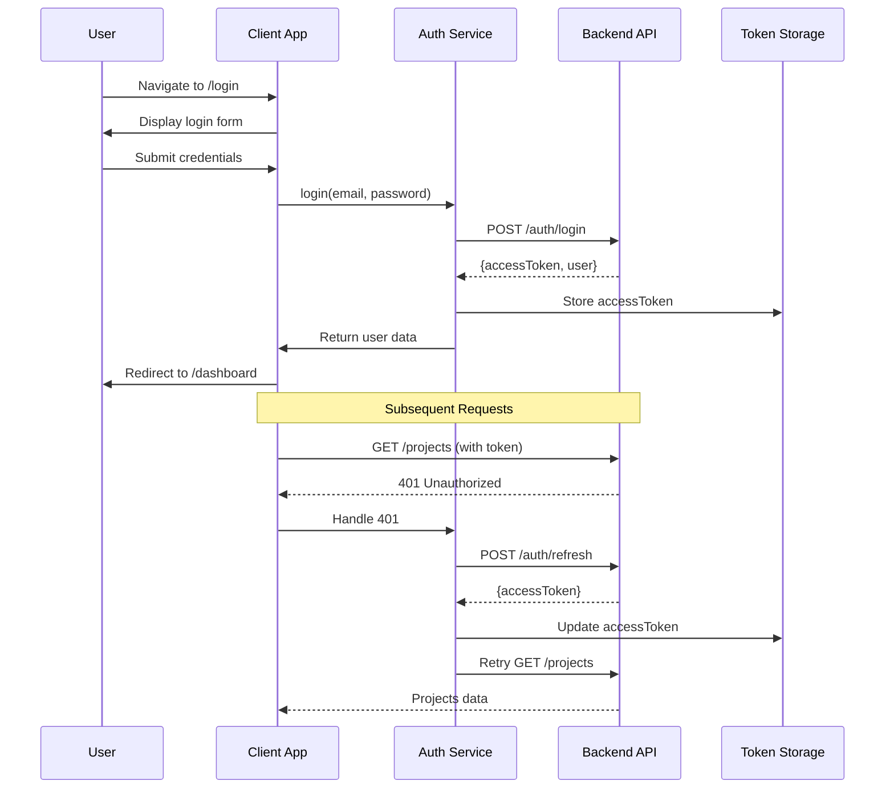

# Design Document: Nexus Frontend

## Overview

The Nexus Frontend is a production-grade Next.js 14 App Router application that provides a modern, interview-ready user interface for the Nexus project management system. Built with TypeScript and Tailwind CSS, it implements a "Precision Dark" design language inspired by Linear.app and Vercel, featuring a dark theme with subtle gradients, clean minimal interfaces, and smooth animations. The frontend communicates with the existing NestJS REST API backend running at http://localhost:5000, implementing JWT-based authentication with refresh token rotation, comprehensive form validation using react-hook-form and zod, efficient data fetching and caching with SWR, and responsive mobile-first design patterns.

The application serves as a portfolio-quality full-stack project demonstrating modern React/Next.js skills, clean architecture, professional UI/UX design, and production-ready patterns including protected routes, loading states, error boundaries, and optimistic updates. Core features include authentication flows (login/register), a projects dashboard with CRUD operations, a Kanban-style task board with drag-and-drop functionality, and role-based access control for admin features.

## Architecture

The application follows Next.js 14 App Router conventions with a feature-based directory structure, separating concerns into distinct layers: presentation components, business logic hooks, API integration services, and shared utilities. The architecture emphasizes type safety, reusability, and testability.

```mermaid
graph TD
    A[Next.js App Router] --> B[Layout Components]
    A --> C[Page Components]
    A --> D[API Routes]
    
    C --> E[Feature Components]
    E --> F[UI Components]
    E --> G[Custom Hooks]
    
    G --> H[SWR Data Fetching]
    G --> I[Form Management]
    
    H --> J[API Client - Axios]
    I --> K[Validation - Zod]
    
    J --> L[Backend API]
    J --> M[Auth Interceptor]
    
    M --> N[Token Storage]
    M --> O[Token Refresh]
    
    B --> P[Auth Provider]
    P --> N
    
    style A fill:#1a1a1a
    style L fill:#2a2a2a
    style P fill:#3a3a3a
```



## Main Workflow: Authentication Flow



## Components and Interfaces

### Component 1: AuthProvider

**Purpose**: Manages global authentication state, token storage, and automatic token refresh logic. Provides authentication context to all child components.

**Interface**:
```typescript
interface AuthContextValue {
  user: User | null
  isLoading: boolean
  isAuthenticated: boolean
  login: (email: string, password: string) => Promise<void>
  register: (data: RegisterInput) => Promise<void>
  logout: () => Promise<void>
  refreshToken: () => Promise<void>
}

interface AuthProviderProps {
  children: React.ReactNode
}
```

**Responsibilities**:
- Maintain current user state across the application
- Handle login, register, and logout operations
- Automatically refresh access tokens before expiry
- Persist authentication state across page reloads
- Provide authentication status to child components

### Component 2: ProtectedRoute

**Purpose**: Higher-order component that wraps pages requiring authentication, redirecting unauthenticated users to login.

**Interface**:
```typescript
interface ProtectedRouteProps {
  children: React.ReactNode
  requiredRole?: 'USER' | 'ADMIN'
  fallback?: React.ReactNode
}
```

**Responsibilities**:
- Check authentication status before rendering protected content
- Redirect to login page if user is not authenticated
- Verify user role matches required role (if specified)
- Display loading state during authentication check
- Preserve intended destination for post-login redirect

### Component 3: ProjectCard

**Purpose**: Displays project information in a card format with actions for edit and delete.

**Interface**:
```typescript
interface ProjectCardProps {
  project: Project
  onEdit: (project: Project) => void
  onDelete: (projectId: string) => void
  isLoading?: boolean
}

interface Project {
  id: string
  name: string
  description: string | null
  status: 'ACTIVE' | 'ARCHIVED'
  ownerId: string
  createdAt: string
  updatedAt: string
}
```

**Responsibilities**:
- Render project details in a visually appealing card
- Provide edit and delete action buttons
- Show loading state during mutations
- Display project status badge
- Format dates for display

### Component 4: TaskBoard

**Purpose**: Kanban-style board displaying tasks organized by status columns with drag-and-drop functionality.

**Interface**:
```typescript
interface TaskBoardProps {
  projectId: string
  tasks: Task[]
  onTaskUpdate: (taskId: string, updates: Partial<Task>) => Promise<void>
  onTaskCreate: (task: CreateTaskInput) => Promise<void>
  onTaskDelete: (taskId: string) => Promise<void>
}

interface Task {
  id: string
  title: string
  description: string | null
  status: 'TODO' | 'IN_PROGRESS' | 'IN_REVIEW' | 'DONE'
  priority: 'LOW' | 'MEDIUM' | 'HIGH' | 'URGENT'
  dueDate: string | null
  projectId: string
  assigneeId: string | null
  createdAt: string
  updatedAt: string
}
```

**Responsibilities**:
- Render task columns for each status (TODO, IN_PROGRESS, IN_REVIEW, DONE)
- Enable drag-and-drop task movement between columns
- Update task status when dropped in new column
- Display task cards with priority indicators
- Handle optimistic updates for smooth UX

### Component 5: LoginForm

**Purpose**: Form component for user authentication with validation and error handling.

**Interface**:
```typescript
interface LoginFormProps {
  onSuccess?: () => void
  redirectTo?: string
}

interface LoginFormData {
  email: string
  password: string
}
```

**Responsibilities**:
- Render email and password input fields
- Validate form inputs using Zod schema
- Display validation errors inline
- Handle form submission with loading state
- Show API error messages
- Redirect on successful login

### Component 6: ProjectForm

**Purpose**: Reusable form for creating and editing projects.

**Interface**:
```typescript
interface ProjectFormProps {
  project?: Project
  onSubmit: (data: ProjectFormData) => Promise<void>
  onCancel: () => void
  isLoading?: boolean
}

interface ProjectFormData {
  name: string
  description: string
  status: 'ACTIVE' | 'ARCHIVED'
}
```

**Responsibilities**:
- Render form fields for project data
- Pre-populate fields when editing existing project
- Validate inputs with Zod schema
- Handle form submission
- Display loading state during submission
- Show validation and API errors

## Data Models

### Model 1: User

```typescript
interface User {
  id: string
  email: string
  name: string
  role: 'USER' | 'ADMIN'
  createdAt: string
  updatedAt: string
}
```

**Validation Rules**:
- `email`: Must be valid email format, required
- `name`: Minimum 2 characters, maximum 100 characters, required
- `role`: Must be either 'USER' or 'ADMIN'
- `id`: Must be valid UUID v4

### Model 2: Project

```typescript
interface Project {
  id: string
  name: string
  description: string | null
  status: 'ACTIVE' | 'ARCHIVED'
  ownerId: string
  createdAt: string
  updatedAt: string
}
```

**Validation Rules**:
- `name`: Minimum 3 characters, maximum 100 characters, required
- `description`: Maximum 500 characters, optional
- `status`: Must be either 'ACTIVE' or 'ARCHIVED'
- `ownerId`: Must be valid UUID v4

### Model 3: Task

```typescript
interface Task {
  id: string
  title: string
  description: string | null
  status: 'TODO' | 'IN_PROGRESS' | 'IN_REVIEW' | 'DONE'
  priority: 'LOW' | 'MEDIUM' | 'HIGH' | 'URGENT'
  dueDate: string | null
  projectId: string
  assigneeId: string | null
  createdAt: string
  updatedAt: string
}
```

**Validation Rules**:
- `title`: Minimum 3 characters, maximum 200 characters, required
- `description`: Maximum 1000 characters, optional
- `status`: Must be one of 'TODO', 'IN_PROGRESS', 'IN_REVIEW', 'DONE'
- `priority`: Must be one of 'LOW', 'MEDIUM', 'HIGH', 'URGENT'
- `dueDate`: Must be valid ISO 8601 date string, optional
- `projectId`: Must be valid UUID v4
- `assigneeId`: Must be valid UUID v4, optional

### Model 4: API Response Envelope

```typescript
interface ApiSuccessResponse<T> {
  success: true
  data: T
  meta?: PaginationMeta
}

interface ApiErrorResponse {
  success: false
  statusCode: number
  message: string
  errors?: ValidationError[]
  timestamp: string
}

interface PaginationMeta {
  total: number
  page: number
  limit: number
  totalPages: number
}

interface ValidationError {
  field: string
  message: string
}
```

## Algorithmic Pseudocode

### Main Processing Algorithm: Token Refresh Flow

```typescript
/**
 * Algorithm: Automatic Token Refresh
 * Ensures access tokens are refreshed before expiry to maintain seamless user experience
 */

async function setupTokenRefresh(): Promise<void> {
  // INPUT: Current access token from storage
  // OUTPUT: Refreshed access token stored
  
  const accessToken = getAccessToken()
  
  if (!accessToken) {
    return // No token to refresh
  }
  
  // Decode token to get expiry time
  const decoded = decodeJWT(accessToken)
  const expiryTime = decoded.exp * 1000 // Convert to milliseconds
  const currentTime = Date.now()
  const timeUntilExpiry = expiryTime - currentTime
  
  // Refresh 1 minute before expiry
  const refreshTime = timeUntilExpiry - 60000
  
  if (refreshTime > 0) {
    setTimeout(async () => {
      try {
        const response = await apiClient.post('/auth/refresh')
        const newAccessToken = response.data.data.accessToken
        setAccessToken(newAccessToken)
        
        // Setup next refresh cycle
        setupTokenRefresh()
      } catch (error) {
        // Refresh failed, logout user
        handleLogout()
      }
    }, refreshTime)
  } else {
    // Token already expired or about to expire, refresh immediately
    await refreshToken()
  }
}
```

**Preconditions**:
- Access token exists in storage
- Refresh token cookie is valid and not expired
- API endpoint /auth/refresh is available

**Postconditions**:
- New access token is stored in memory
- Next refresh cycle is scheduled
- If refresh fails, user is logged out

**Loop Invariants**: N/A (uses setTimeout for scheduling)

### Validation Algorithm: Form Validation with Zod

```typescript
/**
 * Algorithm: Validate Login Form
 * Validates user input before submission using Zod schema
 */

function validateLoginForm(data: unknown): ValidationResult<LoginFormData> {
  // INPUT: data - unknown type from form submission
  // OUTPUT: ValidationResult with either validated data or errors
  
  const loginSchema = z.object({
    email: z.string()
      .min(1, 'Email is required')
      .email('Invalid email format'),
    password: z.string()
      .min(8, 'Password must be at least 8 characters')
      .regex(/[A-Z]/, 'Password must contain uppercase letter')
      .regex(/[a-z]/, 'Password must contain lowercase letter')
      .regex(/[0-9]/, 'Password must contain number')
      .regex(/[^A-Za-z0-9]/, 'Password must contain special character')
  })
  
  try {
    const validated = loginSchema.parse(data)
    return { success: true, data: validated }
  } catch (error) {
    if (error instanceof z.ZodError) {
      const errors = error.errors.map(err => ({
        field: err.path.join('.'),
        message: err.message
      }))
      return { success: false, errors }
    }
    throw error
  }
}

interface ValidationResult<T> {
  success: boolean
  data?: T
  errors?: Array<{ field: string; message: string }>
}
```

**Preconditions**:
- Input data is provided (may be invalid)
- Zod schema is properly defined

**Postconditions**:
- Returns success with validated data if all validations pass
- Returns failure with detailed error messages if validation fails
- No side effects on input data

**Loop Invariants**: 
- For error mapping: All previously processed errors are valid ZodError instances

### Data Fetching Algorithm: SWR with Authentication

```typescript
/**
 * Algorithm: Fetch Projects with SWR
 * Implements data fetching with caching, revalidation, and error handling
 */

function useProjects(filters?: ProjectFilters) {
  // INPUT: filters - optional query parameters
  // OUTPUT: SWR response with projects data, loading state, and error
  
  const { user } = useAuth()
  
  // Build query string from filters
  const queryParams = new URLSearchParams()
  if (filters?.status) queryParams.append('status', filters.status)
  if (filters?.search) queryParams.append('search', filters.search)
  if (filters?.page) queryParams.append('page', filters.page.toString())
  if (filters?.limit) queryParams.append('limit', filters.limit.toString())
  
  const queryString = queryParams.toString()
  const endpoint = `/projects${queryString ? `?${queryString}` : ''}`
  
  const { data, error, mutate, isLoading } = useSWR(
    user ? endpoint : null, // Only fetch if authenticated
    fetcher,
    {
      revalidateOnFocus: true,
      revalidateOnReconnect: true,
      dedupingInterval: 2000,
      onError: (err) => {
        if (err.response?.status === 401) {
          // Token expired, trigger refresh
          handleTokenRefresh()
        }
      }
    }
  )
  
  return {
    projects: data?.data || [],
    meta: data?.meta,
    isLoading,
    error,
    mutate
  }
}

async function fetcher(url: string) {
  const response = await apiClient.get(url)
  return response.data
}
```

**Preconditions**:
- User is authenticated (has valid access token)
- API endpoint is available
- SWR is properly configured

**Postconditions**:
- Returns projects data when fetch succeeds
- Returns error when fetch fails
- Caches response for subsequent requests
- Automatically revalidates on focus/reconnect

**Loop Invariants**: N/A (SWR handles internal caching logic)

## Key Functions with Formal Specifications

### Function 1: apiClient.request()

```typescript
async function request<T>(
  method: 'GET' | 'POST' | 'PATCH' | 'DELETE',
  url: string,
  data?: unknown,
  config?: AxiosRequestConfig
): Promise<ApiSuccessResponse<T>>
```

**Preconditions:**
- `url` is a valid API endpoint path
- `method` is one of the supported HTTP methods
- If method is POST/PATCH, `data` should be provided
- Access token exists in storage for authenticated endpoints

**Postconditions:**
- Returns ApiSuccessResponse<T> on success (2xx status)
- Throws ApiError on failure (4xx, 5xx status)
- Automatically includes Authorization header if token exists
- Automatically retries request once if 401 error (after token refresh)
- Request timeout is 30 seconds

**Loop Invariants:** N/A

### Function 2: useAuth().login()

```typescript
async function login(email: string, password: string): Promise<void>
```

**Preconditions:**
- `email` is valid email format
- `password` meets complexity requirements (validated by Zod)
- User is not already authenticated

**Postconditions:**
- On success: User state is updated, access token is stored, refresh token cookie is set
- On failure: Throws error with message from API
- Triggers navigation to dashboard on success
- Sets up automatic token refresh cycle

**Loop Invariants:** N/A

### Function 3: useProjects().createProject()

```typescript
async function createProject(data: CreateProjectInput): Promise<Project>
```

**Preconditions:**
- User is authenticated
- `data.name` is 3-100 characters
- `data.description` is max 500 characters (optional)
- `data.status` is 'ACTIVE' or 'ARCHIVED'

**Postconditions:**
- Returns newly created Project object on success
- Throws ApiError on validation or server errors
- Triggers SWR cache revalidation for projects list
- Optimistically updates UI before server response

**Loop Invariants:** N/A

### Function 4: useTasks().updateTaskStatus()

```typescript
async function updateTaskStatus(
  taskId: string,
  newStatus: TaskStatus
): Promise<Task>
```

**Preconditions:**
- User is authenticated
- `taskId` is valid UUID of existing task
- `newStatus` is one of 'TODO', 'IN_PROGRESS', 'IN_REVIEW', 'DONE'
- User has permission to update task (owns project or is assignee)

**Postconditions:**
- Returns updated Task object with new status
- Throws ApiError if task not found or permission denied
- Triggers SWR cache revalidation for tasks list
- Optimistically updates UI with rollback on error

**Loop Invariants:** N/A

### Function 5: handleDragEnd()

```typescript
function handleDragEnd(result: DropResult): void
```

**Preconditions:**
- `result` contains valid source and destination information
- `result.draggableId` is valid task ID
- `result.destination` exists (not dropped outside droppable area)
- User has permission to update task

**Postconditions:**
- Task status is updated if dropped in different column
- UI is optimistically updated before API call
- API call is made to persist status change
- On API error, UI reverts to previous state
- No action taken if dropped in same position

**Loop Invariants:** N/A

## Example Usage

### Example 1: Authentication Flow

```typescript
// Login page component
'use client'

import { useAuth } from '@/contexts/auth-context'
import { LoginForm } from '@/components/auth/login-form'
import { useRouter } from 'next/navigation'

export default function LoginPage() {
  const { login, isLoading } = useAuth()
  const router = useRouter()
  
  const handleLogin = async (data: LoginFormData) => {
    try {
      await login(data.email, data.password)
      router.push('/dashboard')
    } catch (error) {
      // Error is handled by LoginForm component
      console.error('Login failed:', error)
    }
  }
  
  return (
    <div className="min-h-screen flex items-center justify-center">
      <LoginForm onSubmit={handleLogin} isLoading={isLoading} />
    </div>
  )
}
```

### Example 2: Data Fetching with SWR

```typescript
// Projects dashboard page
'use client'

import { useProjects } from '@/hooks/use-projects'
import { ProjectCard } from '@/components/projects/project-card'
import { ProjectFilters } from '@/components/projects/project-filters'
import { useState } from 'react'

export default function ProjectsPage() {
  const [filters, setFilters] = useState<ProjectFilters>({
    status: undefined,
    search: '',
    page: 1,
    limit: 10
  })
  
  const { projects, meta, isLoading, error, mutate } = useProjects(filters)
  
  const handleDelete = async (projectId: string) => {
    try {
      await deleteProject(projectId)
      mutate() // Revalidate cache
    } catch (error) {
      console.error('Delete failed:', error)
    }
  }
  
  if (isLoading) return <LoadingSpinner />
  if (error) return <ErrorMessage error={error} />
  
  return (
    <div className="container mx-auto p-6">
      <ProjectFilters filters={filters} onChange={setFilters} />
      <div className="grid grid-cols-1 md:grid-cols-2 lg:grid-cols-3 gap-4">
        {projects.map(project => (
          <ProjectCard
            key={project.id}
            project={project}
            onDelete={handleDelete}
          />
        ))}
      </div>
      <Pagination meta={meta} onChange={(page) => setFilters({ ...filters, page })} />
    </div>
  )
}
```

### Example 3: Form Validation with Zod

```typescript
// Project form component
'use client'

import { useForm } from 'react-hook-form'
import { zodResolver } from '@hookform/resolvers/zod'
import { z } from 'zod'

const projectSchema = z.object({
  name: z.string()
    .min(3, 'Name must be at least 3 characters')
    .max(100, 'Name must not exceed 100 characters'),
  description: z.string()
    .max(500, 'Description must not exceed 500 characters')
    .optional(),
  status: z.enum(['ACTIVE', 'ARCHIVED'])
})

type ProjectFormData = z.infer<typeof projectSchema>

export function ProjectForm({ onSubmit, defaultValues }: ProjectFormProps) {
  const {
    register,
    handleSubmit,
    formState: { errors, isSubmitting }
  } = useForm<ProjectFormData>({
    resolver: zodResolver(projectSchema),
    defaultValues
  })
  
  return (
    <form onSubmit={handleSubmit(onSubmit)} className="space-y-4">
      <div>
        <label htmlFor="name">Project Name</label>
        <input
          id="name"
          {...register('name')}
          className="input"
        />
        {errors.name && (
          <p className="text-red-500 text-sm">{errors.name.message}</p>
        )}
      </div>
      
      <div>
        <label htmlFor="description">Description</label>
        <textarea
          id="description"
          {...register('description')}
          className="textarea"
        />
        {errors.description && (
          <p className="text-red-500 text-sm">{errors.description.message}</p>
        )}
      </div>
      
      <button type="submit" disabled={isSubmitting}>
        {isSubmitting ? 'Saving...' : 'Save Project'}
      </button>
    </form>
  )
}
```

### Example 4: Drag-and-Drop Task Board

```typescript
// Task board component with react-beautiful-dnd
'use client'

import { DragDropContext, Droppable, Draggable } from '@hello-pangea/dnd'
import { useTasks } from '@/hooks/use-tasks'
import { TaskCard } from '@/components/tasks/task-card'

const COLUMNS = [
  { id: 'TODO', title: 'To Do' },
  { id: 'IN_PROGRESS', title: 'In Progress' },
  { id: 'IN_REVIEW', title: 'In Review' },
  { id: 'DONE', title: 'Done' }
] as const

export function TaskBoard({ projectId }: { projectId: string }) {
  const { tasks, updateTaskStatus } = useTasks(projectId)
  
  const handleDragEnd = async (result: DropResult) => {
    if (!result.destination) return
    
    const taskId = result.draggableId
    const newStatus = result.destination.droppableId as TaskStatus
    
    // Optimistic update
    const task = tasks.find(t => t.id === taskId)
    if (task && task.status !== newStatus) {
      try {
        await updateTaskStatus(taskId, newStatus)
      } catch (error) {
        // SWR will revert optimistic update on error
        console.error('Failed to update task:', error)
      }
    }
  }
  
  const getTasksByStatus = (status: TaskStatus) => {
    return tasks.filter(task => task.status === status)
  }
  
  return (
    <DragDropContext onDragEnd={handleDragEnd}>
      <div className="grid grid-cols-1 md:grid-cols-4 gap-4">
        {COLUMNS.map(column => (
          <Droppable key={column.id} droppableId={column.id}>
            {(provided, snapshot) => (
              <div
                ref={provided.innerRef}
                {...provided.droppableProps}
                className={`bg-gray-900 rounded-lg p-4 ${
                  snapshot.isDraggingOver ? 'bg-gray-800' : ''
                }`}
              >
                <h3 className="font-semibold mb-4">{column.title}</h3>
                {getTasksByStatus(column.id).map((task, index) => (
                  <Draggable key={task.id} draggableId={task.id} index={index}>
                    {(provided, snapshot) => (
                      <div
                        ref={provided.innerRef}
                        {...provided.draggableProps}
                        {...provided.dragHandleProps}
                      >
                        <TaskCard task={task} isDragging={snapshot.isDragging} />
                      </div>
                    )}
                  </Draggable>
                ))}
                {provided.placeholder}
              </div>
            )}
          </Droppable>
        ))}
      </div>
    </DragDropContext>
  )
}
```

### Example 5: API Client with Interceptors

```typescript
// lib/api-client.ts
import axios, { AxiosError, AxiosRequestConfig } from 'axios'

const apiClient = axios.create({
  baseURL: process.env.NEXT_PUBLIC_API_URL || 'http://localhost:5000/api/v1',
  timeout: 30000,
  withCredentials: true // Include cookies for refresh token
})

// Request interceptor: Add auth token
apiClient.interceptors.request.use(
  (config) => {
    const token = getAccessToken()
    if (token) {
      config.headers.Authorization = `Bearer ${token}`
    }
    return config
  },
  (error) => Promise.reject(error)
)

// Response interceptor: Handle token refresh
apiClient.interceptors.response.use(
  (response) => response,
  async (error: AxiosError) => {
    const originalRequest = error.config as AxiosRequestConfig & { _retry?: boolean }
    
    // If 401 and not already retried, try to refresh token
    if (error.response?.status === 401 && !originalRequest._retry) {
      originalRequest._retry = true
      
      try {
        const response = await axios.post(
          `${apiClient.defaults.baseURL}/auth/refresh`,
          {},
          { withCredentials: true }
        )
        
        const newToken = response.data.data.accessToken
        setAccessToken(newToken)
        
        // Retry original request with new token
        if (originalRequest.headers) {
          originalRequest.headers.Authorization = `Bearer ${newToken}`
        }
        return apiClient(originalRequest)
      } catch (refreshError) {
        // Refresh failed, logout user
        clearAuth()
        window.location.href = '/login'
        return Promise.reject(refreshError)
      }
    }
    
    return Promise.reject(error)
  }
)

export { apiClient }
```

## Correctness Properties

### Property 1: Authentication State Consistency

**Universal Quantification**: For all application states, if a user is authenticated, then an access token exists in storage AND the token is not expired AND the user object is not null.

```typescript
// Property-based test assertion
∀ state ∈ ApplicationStates:
  isAuthenticated(state) ⟹ 
    (accessTokenExists(state) ∧ 
     ¬isTokenExpired(state) ∧ 
     user(state) ≠ null)
```

**Test Implementation**:
```typescript
describe('Authentication State Consistency', () => {
  it('should maintain consistent auth state', () => {
    const { result } = renderHook(() => useAuth())
    
    // When authenticated
    if (result.current.isAuthenticated) {
      expect(getAccessToken()).toBeTruthy()
      expect(isTokenExpired(getAccessToken())).toBe(false)
      expect(result.current.user).not.toBeNull()
    }
  })
})
```

### Property 2: Protected Route Access Control

**Universal Quantification**: For all protected routes, if a user is not authenticated, then the user is redirected to the login page AND the intended destination is preserved for post-login redirect.

```typescript
∀ route ∈ ProtectedRoutes, user ∈ Users:
  (¬isAuthenticated(user) ∧ navigateTo(route)) ⟹ 
    (redirectTo('/login') ∧ 
     preserveDestination(route))
```

**Test Implementation**:
```typescript
describe('Protected Route Access Control', () => {
  it('should redirect unauthenticated users to login', () => {
    // Attempt to access protected route without auth
    render(<ProtectedRoute><Dashboard /></ProtectedRoute>)
    
    expect(mockRouter.push).toHaveBeenCalledWith('/login?redirect=/dashboard')
  })
})
```

### Property 3: Form Validation Completeness

**Universal Quantification**: For all form submissions, if the input data is invalid according to the Zod schema, then the form displays error messages for all invalid fields AND the form is not submitted to the API.

```typescript
∀ formData ∈ FormInputs, schema ∈ ZodSchemas:
  ¬isValid(formData, schema) ⟹ 
    (displayErrors(getInvalidFields(formData, schema)) ∧ 
     ¬submitToAPI(formData))
```

**Test Implementation**:
```typescript
describe('Form Validation Completeness', () => {
  it('should display all validation errors and prevent submission', async () => {
    const { getByLabelText, getByText, queryByText } = render(<LoginForm />)
    
    // Submit with invalid data
    fireEvent.click(getByText('Login'))
    
    await waitFor(() => {
      expect(queryByText('Email is required')).toBeInTheDocument()
      expect(queryByText('Password must be at least 8 characters')).toBeInTheDocument()
    })
    
    // API should not be called
    expect(mockApiClient.post).not.toHaveBeenCalled()
  })
})
```

### Property 4: Optimistic Update Rollback

**Universal Quantification**: For all optimistic updates, if the API request fails, then the UI state is reverted to the previous state AND an error message is displayed to the user.

```typescript
∀ update ∈ OptimisticUpdates:
  (applyOptimisticUpdate(update) ∧ apiRequestFails(update)) ⟹ 
    (revertToState(previousState(update)) ∧ 
     displayError(errorMessage(update)))
```

**Test Implementation**:
```typescript
describe('Optimistic Update Rollback', () => {
  it('should revert state on API failure', async () => {
    const { result } = renderHook(() => useTasks('project-id'))
    
    const originalTasks = result.current.tasks
    
    // Mock API failure
    mockApiClient.patch.mockRejectedValueOnce(new Error('API Error'))
    
    // Attempt optimistic update
    await act(async () => {
      await result.current.updateTaskStatus('task-id', 'DONE')
    })
    
    // State should be reverted
    expect(result.current.tasks).toEqual(originalTasks)
  })
})
```

### Property 5: Token Refresh Timing

**Universal Quantification**: For all access tokens, if the token is within 1 minute of expiry, then a refresh request is automatically triggered AND the new token is stored before the old token expires.

```typescript
∀ token ∈ AccessTokens:
  (timeUntilExpiry(token) ≤ 60000ms) ⟹ 
    (triggerRefresh(token) ∧ 
     storeNewToken(newToken) ∧ 
     timestamp(storeNewToken) < expiryTime(token))
```

**Test Implementation**:
```typescript
describe('Token Refresh Timing', () => {
  it('should refresh token before expiry', async () => {
    jest.useFakeTimers()
    
    // Set token that expires in 2 minutes
    const token = createToken({ exp: Date.now() / 1000 + 120 })
    setAccessToken(token)
    
    setupTokenRefresh()
    
    // Fast-forward to 1 minute before expiry
    jest.advanceTimersByTime(60000)
    
    await waitFor(() => {
      expect(mockApiClient.post).toHaveBeenCalledWith('/auth/refresh')
    })
    
    jest.useRealTimers()
  })
})
```

### Property 6: SWR Cache Consistency

**Universal Quantification**: For all data mutations, after a successful mutation, the SWR cache is revalidated AND the UI displays the updated data from the server.

```typescript
∀ mutation ∈ DataMutations:
  mutationSucceeds(mutation) ⟹ 
    (revalidateCache(getCacheKey(mutation)) ∧ 
     displayData(getServerData(mutation)))
```

**Test Implementation**:
```typescript
describe('SWR Cache Consistency', () => {
  it('should revalidate cache after mutation', async () => {
    const { result } = renderHook(() => useProjects())
    
    // Perform mutation
    await act(async () => {
      await result.current.createProject({ name: 'New Project', status: 'ACTIVE' })
    })
    
    // Cache should be revalidated
    await waitFor(() => {
      expect(mockApiClient.get).toHaveBeenCalledWith('/projects')
    })
  })
})
```

## Error Handling

### Error Scenario 1: Network Failure

**Condition**: API request fails due to network connectivity issues (timeout, DNS failure, connection refused)

**Response**: 
- Display user-friendly error message: "Unable to connect to server. Please check your internet connection."
- Show retry button to attempt request again
- Log detailed error to console for debugging
- Do not clear user's form input data

**Recovery**:
- User clicks retry button to reattempt request
- If retry succeeds, proceed with normal flow
- If retry fails, suggest checking network settings or trying again later
- Preserve application state (no logout required)

### Error Scenario 2: Authentication Failure (401)

**Condition**: API returns 401 Unauthorized status, indicating expired or invalid access token

**Response**:
- Automatically attempt token refresh using refresh token cookie
- If refresh succeeds, retry original request with new token
- If refresh fails, clear authentication state and redirect to login
- Display message: "Your session has expired. Please log in again."

**Recovery**:
- User logs in again with credentials
- After successful login, redirect to originally intended page
- Restore any unsaved form data from session storage if available

### Error Scenario 3: Validation Error (400)

**Condition**: API returns 400 Bad Request with validation errors for form submission

**Response**:
- Parse validation errors from API response
- Display field-specific error messages below each invalid input
- Highlight invalid fields with red border
- Keep form in editable state with user's input preserved
- Do not show generic error message if field-specific errors are available

**Recovery**:
- User corrects invalid fields based on error messages
- Form revalidates on blur or on submit
- When all validations pass, form submits successfully

### Error Scenario 4: Permission Denied (403)

**Condition**: User attempts to access resource or perform action they don't have permission for

**Response**:
- Display error message: "You don't have permission to perform this action."
- Do not redirect user away from current page
- Hide or disable UI elements for actions user cannot perform
- Log permission error for security monitoring

**Recovery**:
- User acknowledges error and continues using permitted features
- If user believes they should have access, provide contact information for admin
- Admin can update user role through admin panel

### Error Scenario 5: Resource Not Found (404)

**Condition**: User navigates to or requests a resource that doesn't exist (deleted project, invalid task ID)

**Response**:
- Display error message: "The requested resource was not found."
- Provide navigation options: "Go to Dashboard" or "View All Projects"
- If resource was recently deleted, show informational message
- Remove invalid resource from local cache

**Recovery**:
- User navigates to valid page using provided links
- SWR cache is revalidated to ensure data consistency
- If user has direct link, suggest checking URL for typos

### Error Scenario 6: Server Error (500)

**Condition**: API returns 500 Internal Server Error or other 5xx status codes

**Response**:
- Display generic error message: "Something went wrong on our end. Please try again."
- Show retry button for the failed operation
- Log full error details to error tracking service (e.g., Sentry)
- Do not expose internal error details to user

**Recovery**:
- User clicks retry button to attempt operation again
- If error persists, suggest trying again later
- Provide support contact information for persistent issues
- Application remains functional for other operations

### Error Scenario 7: Rate Limit Exceeded (429)

**Condition**: User exceeds API rate limits (100 requests/minute global, 10 requests/minute for auth)

**Response**:
- Display error message: "Too many requests. Please wait a moment and try again."
- Parse Retry-After header from response if available
- Show countdown timer indicating when user can retry
- Disable submit buttons temporarily

**Recovery**:
- Wait for rate limit window to reset (typically 1 minute)
- Automatically re-enable actions after cooldown period
- User can retry operation after waiting
- Consider implementing client-side request throttling to prevent future rate limit errors

## Testing Strategy

### Unit Testing Approach

**Framework**: Jest with React Testing Library

**Coverage Goals**: Minimum 80% code coverage for all components, hooks, and utilities

**Key Test Cases**:
- Component rendering with various props and states
- User interactions (clicks, form inputs, keyboard navigation)
- Conditional rendering based on props and state
- Error boundary behavior
- Accessibility compliance (ARIA labels, keyboard navigation)

**Example Test Structure**:
```typescript
describe('ProjectCard', () => {
  it('should render project details correctly', () => {
    const project = mockProject()
    render(<ProjectCard project={project} />)
    expect(screen.getByText(project.name)).toBeInTheDocument()
  })
  
  it('should call onDelete when delete button clicked', async () => {
    const onDelete = jest.fn()
    render(<ProjectCard project={mockProject()} onDelete={onDelete} />)
    fireEvent.click(screen.getByRole('button', { name: /delete/i }))
    expect(onDelete).toHaveBeenCalledWith(project.id)
  })
})
```

### Property-Based Testing Approach

**Framework**: fast-check (JavaScript/TypeScript property-based testing library)

**Strategy**: Generate random valid and invalid inputs to test invariants and edge cases

**Key Properties to Test**:
- Form validation: All invalid inputs are rejected, all valid inputs are accepted
- Token refresh: Tokens are always refreshed before expiry
- Optimistic updates: Failed mutations always revert to previous state
- Cache consistency: Mutations always trigger cache revalidation

**Example Property Test**:
```typescript
import fc from 'fast-check'

describe('Form Validation Properties', () => {
  it('should reject all invalid email formats', () => {
    fc.assert(
      fc.property(
        fc.string().filter(s => !isValidEmail(s)),
        (invalidEmail) => {
          const result = validateLoginForm({ email: invalidEmail, password: 'Valid@123' })
          expect(result.success).toBe(false)
          expect(result.errors).toContainEqual(
            expect.objectContaining({ field: 'email' })
          )
        }
      )
    )
  })
  
  it('should accept all valid email formats', () => {
    fc.assert(
      fc.property(
        fc.emailAddress(),
        (validEmail) => {
          const result = validateLoginForm({ 
            email: validEmail, 
            password: 'Valid@123' 
          })
          expect(result.errors?.find(e => e.field === 'email')).toBeUndefined()
        }
      )
    )
  })
})
```

### Integration Testing Approach

**Framework**: Playwright for end-to-end testing

**Strategy**: Test complete user workflows from browser perspective

**Key Integration Tests**:
- Complete authentication flow (register → login → access protected page → logout)
- Project CRUD workflow (create → view → edit → delete)
- Task management workflow (create task → drag to different column → edit → delete)
- Error handling (network failure, validation errors, permission denied)
- Token refresh during long session

**Example Integration Test**:
```typescript
import { test, expect } from '@playwright/test'

test.describe('Authentication Flow', () => {
  test('should complete full auth workflow', async ({ page }) => {
    // Navigate to register page
    await page.goto('/register')
    
    // Fill registration form
    await page.fill('input[name="email"]', 'test@example.com')
    await page.fill('input[name="name"]', 'Test User')
    await page.fill('input[name="password"]', 'Test@123')
    await page.click('button[type="submit"]')
    
    // Should redirect to dashboard
    await expect(page).toHaveURL('/dashboard')
    
    // Should display user name
    await expect(page.locator('text=Test User')).toBeVisible()
    
    // Logout
    await page.click('button:has-text("Logout")')
    
    // Should redirect to login
    await expect(page).toHaveURL('/login')
    
    // Login again
    await page.fill('input[name="email"]', 'test@example.com')
    await page.fill('input[name="password"]', 'Test@123')
    await page.click('button[type="submit"]')
    
    // Should be back at dashboard
    await expect(page).toHaveURL('/dashboard')
  })
})
```

## Performance Considerations

### Code Splitting and Lazy Loading

- Use Next.js dynamic imports for heavy components (drag-and-drop library, charts)
- Lazy load admin panel components only for admin users
- Split vendor bundles to optimize caching
- Target: Initial bundle size < 200KB gzipped

### Image Optimization

- Use Next.js Image component for automatic optimization
- Implement lazy loading for images below the fold
- Use WebP format with fallbacks
- Serve responsive images based on viewport size

### Data Fetching Optimization

- Implement SWR caching with appropriate stale-while-revalidate strategy
- Use pagination for large lists (projects, tasks, users)
- Implement infinite scroll for better UX on long lists
- Prefetch data for likely next navigation (hover intent)
- Debounce search inputs to reduce API calls

### Rendering Performance

- Use React.memo for expensive components that re-render frequently
- Implement virtual scrolling for very long lists (react-window)
- Optimize re-renders by using proper dependency arrays in hooks
- Use CSS transforms for animations (GPU-accelerated)
- Implement skeleton screens for perceived performance

**Performance Targets**:
- First Contentful Paint (FCP): < 1.5s
- Largest Contentful Paint (LCP): < 2.5s
- Time to Interactive (TTI): < 3.5s
- Cumulative Layout Shift (CLS): < 0.1
- First Input Delay (FID): < 100ms

### Caching Strategy

- SWR cache: 5 minutes for project/task lists, 1 hour for user profile
- Browser cache: Aggressive caching for static assets (1 year)
- Service worker: Cache API responses for offline support (optional)
- Local storage: Persist user preferences and draft form data

## Security Considerations

### Authentication Security

- Store access tokens in memory only (not localStorage to prevent XSS)
- Use httpOnly cookies for refresh tokens (prevents JavaScript access)
- Implement automatic token refresh before expiry
- Clear all auth state on logout
- Implement CSRF protection for state-changing operations

### Input Validation

- Client-side validation with Zod schemas (UX improvement)
- Never trust client-side validation alone (server validates)
- Sanitize user inputs before rendering (React does this by default)
- Validate file uploads (type, size) before sending to server
- Implement rate limiting on form submissions (prevent spam)

### XSS Prevention

- Use React's built-in XSS protection (automatic escaping)
- Never use dangerouslySetInnerHTML unless absolutely necessary
- If using dangerouslySetInnerHTML, sanitize with DOMPurify
- Validate and sanitize URLs before rendering links
- Set Content-Security-Policy headers

### HTTPS and Secure Communication

- Enforce HTTPS in production (redirect HTTP to HTTPS)
- Use secure flag on cookies in production
- Implement Strict-Transport-Security header
- Validate SSL certificates for API communication

### Sensitive Data Handling

- Never log sensitive data (passwords, tokens) to console in production
- Mask sensitive fields in error reports
- Clear sensitive form data from memory after submission
- Implement proper error messages (don't leak system information)

### Dependency Security

- Regularly update dependencies to patch vulnerabilities
- Use npm audit to check for known vulnerabilities
- Implement Dependabot or similar for automated security updates
- Review third-party packages before adding to project

## Dependencies

### Core Framework
- **next** (^14.0.0): React framework with App Router, SSR, and routing
- **react** (^18.2.0): UI library
- **react-dom** (^18.2.0): React DOM renderer
- **typescript** (^5.3.0): Type safety and developer experience

### Styling
- **tailwindcss** (^3.4.0): Utility-first CSS framework
- **autoprefixer** (^10.4.0): PostCSS plugin for vendor prefixes
- **postcss** (^8.4.0): CSS transformation tool

### Forms and Validation
- **react-hook-form** (^7.49.0): Performant form library with validation
- **zod** (^3.22.0): TypeScript-first schema validation
- **@hookform/resolvers** (^3.3.0): Validation resolvers for react-hook-form

### Data Fetching
- **swr** (^2.2.0): React hooks for data fetching with caching and revalidation
- **axios** (^1.6.0): Promise-based HTTP client with interceptors

### UI Components and Icons
- **lucide-react** (^0.300.0): Icon library (icons only, no component library)
- **@hello-pangea/dnd** (^16.5.0): Drag-and-drop library (fork of react-beautiful-dnd)

### Utilities
- **clsx** (^2.1.0): Utility for constructing className strings conditionally
- **date-fns** (^3.0.0): Modern date utility library
- **jwt-decode** (^4.0.0): Decode JWT tokens without verification (client-side only)

### Development Dependencies
- **@types/node** (^20.10.0): TypeScript types for Node.js
- **@types/react** (^18.2.0): TypeScript types for React
- **@types/react-dom** (^18.2.0): TypeScript types for React DOM
- **eslint** (^8.56.0): Linting tool
- **eslint-config-next** (^14.0.0): ESLint configuration for Next.js
- **prettier** (^3.1.0): Code formatter
- **@testing-library/react** (^14.1.0): React testing utilities
- **@testing-library/jest-dom** (^6.1.0): Custom Jest matchers for DOM
- **jest** (^29.7.0): Testing framework
- **jest-environment-jsdom** (^29.7.0): Jest environment for DOM testing
- **@playwright/test** (^1.40.0): End-to-end testing framework
- **fast-check** (^3.15.0): Property-based testing library

### Optional Dependencies (Nice-to-Have)
- **@sentry/nextjs** (^7.91.0): Error tracking and monitoring
- **react-hot-toast** (^2.4.0): Toast notifications
- **framer-motion** (^10.16.0): Animation library for smooth transitions

## Project Structure

```
nexus-frontend/
├── app/                          # Next.js 14 App Router
│   ├── (auth)/                   # Auth route group (no layout)
│   │   ├── login/
│   │   │   └── page.tsx
│   │   └── register/
│   │       └── page.tsx
│   ├── (dashboard)/              # Dashboard route group (with layout)
│   │   ├── layout.tsx
│   │   ├── dashboard/
│   │   │   └── page.tsx
│   │   ├── projects/
│   │   │   ├── page.tsx
│   │   │   ├── [id]/
│   │   │   │   ├── page.tsx
│   │   │   │   └── tasks/
│   │   │   │       └── page.tsx
│   │   └── admin/                # Admin-only routes
│   │       ├── page.tsx
│   │       └── users/
│   │           └── page.tsx
│   ├── layout.tsx                # Root layout
│   ├── page.tsx                  # Home page
│   └── globals.css               # Global styles
├── components/                   # React components
│   ├── auth/
│   │   ├── login-form.tsx
│   │   ├── register-form.tsx
│   │   └── protected-route.tsx
│   ├── projects/
│   │   ├── project-card.tsx
│   │   ├── project-form.tsx
│   │   ├── project-list.tsx
│   │   └── project-filters.tsx
│   ├── tasks/
│   │   ├── task-board.tsx
│   │   ├── task-card.tsx
│   │   ├── task-form.tsx
│   │   └── task-column.tsx
│   ├── ui/                       # Reusable UI components
│   │   ├── button.tsx
│   │   ├── input.tsx
│   │   ├── modal.tsx
│   │   ├── loading-spinner.tsx
│   │   └── error-message.tsx
│   └── layout/
│       ├── header.tsx
│       ├── sidebar.tsx
│       └── footer.tsx
├── contexts/                     # React contexts
│   └── auth-context.tsx
├── hooks/                        # Custom React hooks
│   ├── use-auth.ts
│   ├── use-projects.ts
│   ├── use-tasks.ts
│   └── use-users.ts
├── lib/                          # Utilities and configurations
│   ├── api-client.ts             # Axios instance with interceptors
│   ├── auth.ts                   # Auth utilities (token storage)
│   ├── validators.ts             # Zod schemas
│   └── utils.ts                  # Helper functions
├── types/                        # TypeScript type definitions
│   ├── api.ts                    # API response types
│   ├── models.ts                 # Data model types
│   └── index.ts
├── public/                       # Static assets
│   ├── images/
│   └── favicon.ico
├── tests/                        # Test files
│   ├── unit/
│   ├── integration/
│   └── e2e/
├── .env.local                    # Environment variables
├── .eslintrc.json                # ESLint configuration
├── .prettierrc                   # Prettier configuration
├── jest.config.js                # Jest configuration
├── next.config.js                # Next.js configuration
├── playwright.config.ts          # Playwright configuration
├── postcss.config.js             # PostCSS configuration
├── tailwind.config.ts            # Tailwind configuration
├── tsconfig.json                 # TypeScript configuration
└── package.json                  # Dependencies and scripts
```

## Environment Variables

```env
# API Configuration
NEXT_PUBLIC_API_URL=http://localhost:5000/api/v1

# Application Configuration
NEXT_PUBLIC_APP_NAME=Nexus
NEXT_PUBLIC_APP_URL=http://localhost:3000

# Feature Flags (Optional)
NEXT_PUBLIC_ENABLE_ADMIN_PANEL=true
NEXT_PUBLIC_ENABLE_DARK_MODE_TOGGLE=false

# Error Tracking (Optional)
NEXT_PUBLIC_SENTRY_DSN=

# Analytics (Optional)
NEXT_PUBLIC_GA_TRACKING_ID=
```
